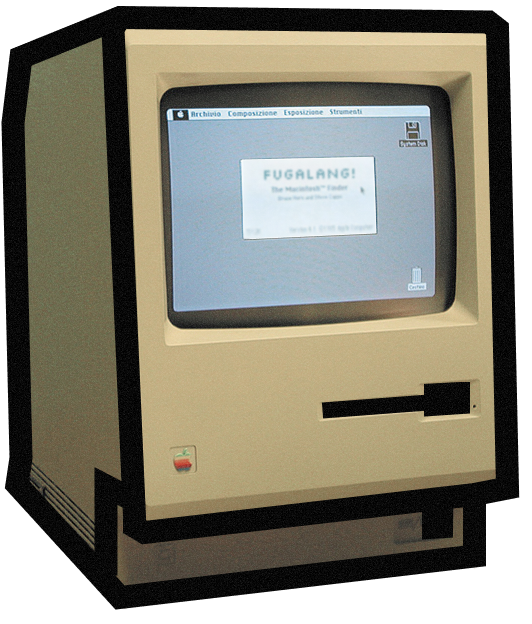

<div align="center">

<table>
<tr>
<td width="600">



</td>

<td>

# fugalang

**Современный компилируемый язык программирования.**

fuga создаётся с упором на:

- простоту
- выразительный лаконичный синтаксис
- удобная работа с памятью
- мощную систему библиатек

</td>
</tr>
</table>

<p align="center">
  
  
  
</p>

</div>

## Содержание

- [Примеры](#примеры)
- [Лицензия](#лицензия)

## Примеры

```rust
fn Main() {
    std::println!("Hello fuga!")
}
```

[*больше примеров кода*](docs/exemples/README.md)

## Лицензия

fugalang распространяется под лицензией GPL 3

Подробности находятся в файле [LICENSE](LICENSE)
